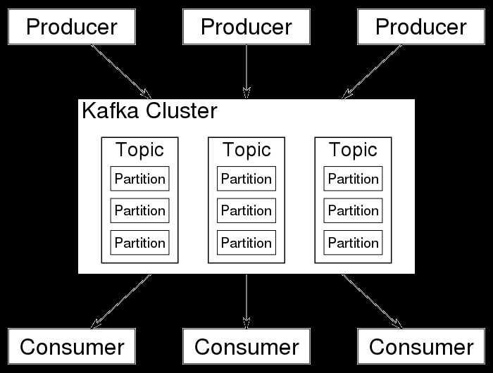
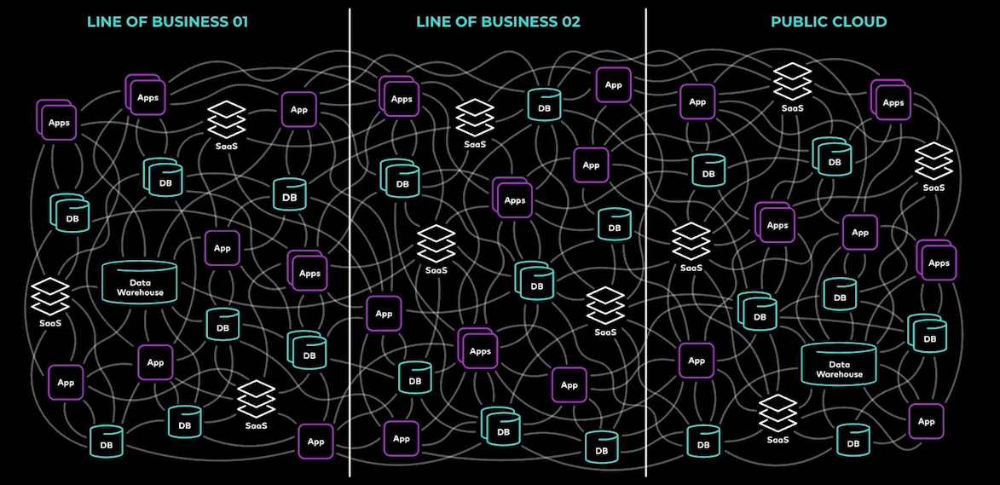

# Agenda

# Theorieteil

## Was ist Kafka?

- "Entkopplungsschicht"
- Event Streaming Platform, Cluster, Java
- Immutable Event Streams

## Warum verwenden wir Kafka?

- Weil es die BA vorschreibt
- Weil es die Services untereinander entkoppelt
- ...

# Kafka Cluster aufsetzen (Kurzform)

- SKIP. Aufgabe von Admins. Wir haben Docker compose Files für die Entwicklung geschrieben

## Begrifflichkeiten

- Message/Event
- Consumer
- Producer
- Topic
- Broker/Leader/Follower
- Partition
- Retention Policy/Log compaction

# Code (Producer/Consumer)

- Kafka in Quarkus
- Kafka in Spring
- Kafka in Serverside JS/TS
- Kafka im Browser

# Design & Best Practices

- Event Types
- Robust vs. schnell
- Transaktionen/Callbacks
- Idempotency
- [Message Strategien - Exactly Once/ At Least Once / At most once](https://mirakl.tech/sending-kafka-message-in-a-transactional-way-34d6d19bb7b2?gi=12b62c658c7a)
- Schema Evolution

# Design Patterns

- Idempotency
- Message Outbox Pattern [Transactional outbox](https://microservices.io/patterns/data/transactional-outbox.html)
- Saga
- Fact Events / Delta Events
- [Dead Letter Queue](https://en.wikipedia.org/wiki/Dead_letter_queue)

# Fragen und Feedback
